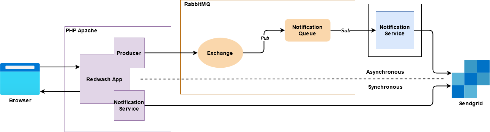

# Redwash App

Redwash App is a web-based application to help vechile wash business with the concept booking system, 
built on Codeigniter 3. This application is now a personal project used as an architectural systems experiment.

## Features
This application has basic features on the booking system:
- Can do customers registration.
- Make a booking for the vehicle you want to wash.
- Display the order of the vechiles that are being processed.
- Washing process reminder via email.

To activate all systems in this project, make sure our computer has [Docker] installed.

## Installation

**Install the systems with script (recommended).**

```sh
./install_script.sh
```

If the systems is running properly it will appear like the following message.

```sh
[~] Run Docker Compose
Creating rabbitmq      ... done
Creating mysql_redwash        ... done
Creating notification_service ... done
Creating auth_notif_service   ... done
Creating phpmyadmin_redwash   ... done
Creating redwash_web          ... done
```

## Application URL

Applications that can be accessed after running

| App | URL |
| ------ | ------ |
| Redwash App | [127.0.0.1:8084][Rwapp] |
| phpmyadmin | [127.0.0.1:8085][Pma] |
| RabbitMQ Manager | [127.0.0.1:15682][Rmgr] |


## Login Access

| App | username | password | role |
| ------ | ------ | ------ | ------ | 
| Redwash App | akuntesting | 12341234 | user
|| karyawan1 | karyawan1 | employee
| phpmyadmin | root | secret | -
| RabbitMQ Manager | admin | admin | -


### **See the notification service process on Docker**
On this system there is a notification service, to view the notification service process can be seen by command.

**For Notification Service**
```sh
docker logs notification_service -f
```

**For Auth Notification Service**
```sh
docker logs auth_notif_service -f
```

## Stop Systems
To shutdown the entire system that is already running, you can use the following command.
```sh
docker-compose down -v
```
> Note: `-v` is mean for delete the volume was created before.
Make you you didn't delete important data was you input on MySQL container.

## Architecture
Here is the architecture


- In this repository the Redwash App runs in the Docker environment
- Notification Service is written in Python.
- Web App can only send a message without receive response from service.
- Exchange is used when a message is needed to be sent to more than one Queue.
- Exchange can route a message conditionally, in this scenario it only use Direct Routing.
- Booking and Update Booking used asynchronous request for email messaging.
- Reset Password and Registration used synchronous request for email messaging.

## License

MIT

Best regards,
**Rafi Khalish**

   [Docker]: <https://www.docker.com/get-started>
   [Rwapp]: https://www.docker.com/get-started
   [Pma]: https://www.docker.com/get-started
   [Rmgr]: https://www.docker.com/get-started

